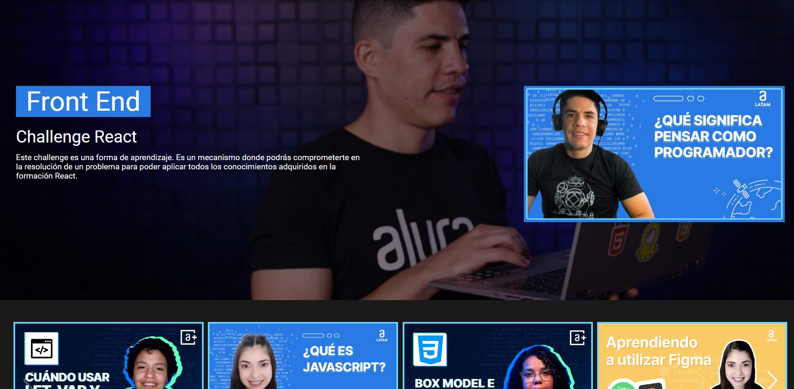
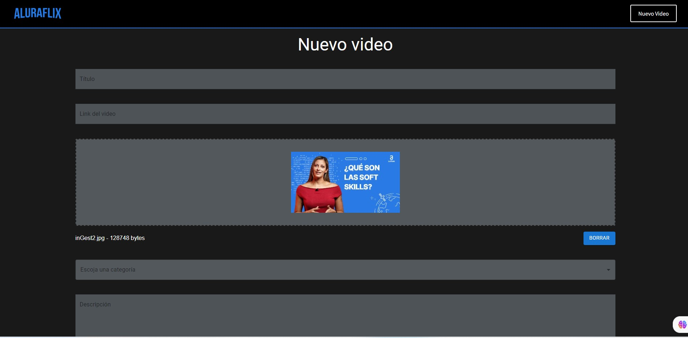
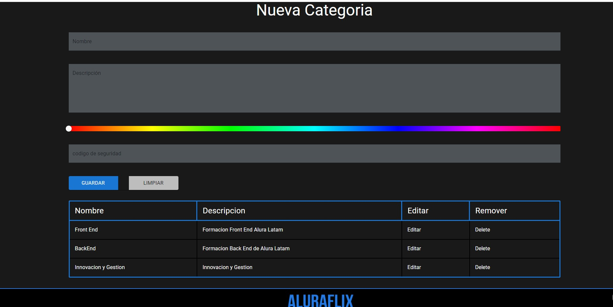

# AluraFlix · Plataforma de videos en React

Aplicación tipo *streaming* para organizar videos educativos por categorías, con carrusel, reproductor integrado y formularios para crear videos y categorías. Es mi solución al **Challenge React** del programa **Oracle Next Education (ONE) + Alura**, y el proyecto con el que di mis primeros pasos en React.


[](LICENSE)



| Nuevo video | Gestión de categorías |
|---|---|
|  |  |

---

## 🎯 Descripción

El reto consistía en construir una SPA en React que muestre videos agrupados por categorías y permita al usuario administrarlos. Lo usé para practicar componentes, enrutamiento, manejo de estado y formularios con validación.

## ✨ Características

- Banner principal y **carrusel de videos por categoría** (Swiper), con el color de cada categoría.
- **Reproductor integrado** (React Player) para ver los videos sin salir de la app.
- **Formulario de nuevo video** con validación (React Hook Form) y carga de miniaturas por arrastrar y soltar (React Dropzone + Cloudinary).
- **CRUD de categorías** con selector de color y tabla para editar o eliminar.
- Notificaciones de éxito y error (notistack).
- Navegación entre vistas con React Router.

## 🛠️ Stack tecnológico

| Área | Tecnologías |
|---|---|
| UI | React 18, Material UI 5, styled-components |
| Navegación y estado | React Router 6, Context API |
| Formularios | React Hook Form, React Dropzone, React Color |
| Multimedia | Swiper, React Player, Cloudinary (carga de imágenes) |
| Datos | JSON Server (API REST simulada), Axios |

## 🗂️ Estructura

```
aluraflix-react-video-platform/
├── public/                  # HTML base e imágenes de las miniaturas
├── src/
│   ├── componentes/         # Header, Banner, Carousel, formularios, Footer...
│   ├── layouts/RootLayout.js
│   ├── styles/              # Tema y estilos globales
│   ├── Context.js           # Estado compartido
│   └── App.js               # Rutas de la aplicación
├── db.json                  # Datos de videos y categorías
├── .env.example             # Variables de entorno de Cloudinary
└── docs/capturas/           # Capturas de pantalla
```

**Rutas:** `/` (inicio) · `/formulariovideos` · `/formulariocategoria` · `/videoPlayer`

## 🚀 Instalación y uso local

Requisitos: [Node.js](https://nodejs.org/) 16 o superior.

```bash
git clone https://github.com/juan-roserodev/aluraflix-react-video-platform.git
cd aluraflix-react-video-platform
npm install
cp .env.example .env   # Completa tus datos de Cloudinary (solo para subir miniaturas)
npm start              # Inicia JSON Server (puerto 3001) y la app de React (puerto 3000)
```

## ✅ Buenas prácticas aplicadas

- **Credenciales fuera del código:** los datos de Cloudinary se leen de variables de entorno (`REACT_APP_*`) y el archivo `.env` está en `.gitignore`.
- **Componentes reutilizables** y estilos encapsulados con styled-components.
- **Validación de formularios** antes de enviar datos a la API.

## 🌱 Próximos pasos

- Publicar una demo en línea con la API desplegada.
- Migrar de Create React App a Vite.
- Agregar pruebas con React Testing Library.

## 👤 Autor

**Juan David Rosero Reyes** · Desarrollador web junior

[](https://juan-roserodev.github.io/)
[](https://www.linkedin.com/in/david-reyes-dev)
[](mailto:juan.rosero21@hotmail.com)
